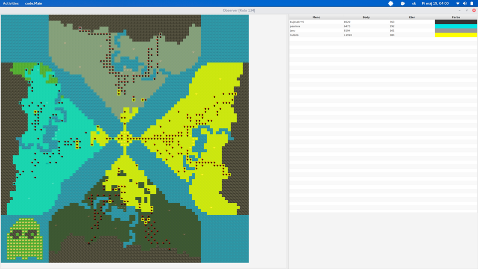
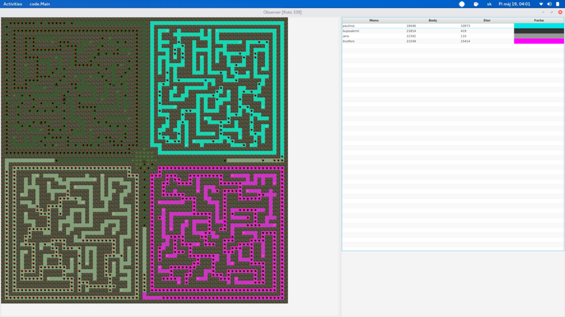
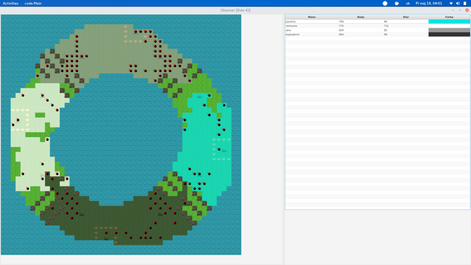
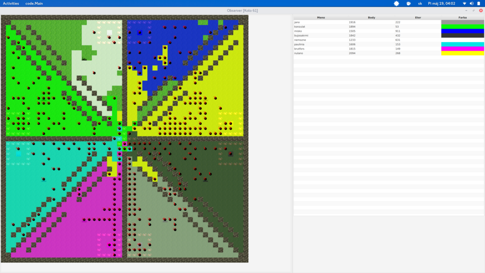

# proboj-2017-jar - Mad Scientists

## Co treba na rozbehanie proboja?

Nasledujúci návod slúži na spustenie hlavného kompu, ak chcete len kódiť 
klienta, prečítajte si dokumentáciu.

Odporucame rozbehavat proboj na linuxe. Na windowse je to bolestive
a nie zdokumentovane, ale ak to date tak vas to urcite posilni...

Na rozbehanie grafickeho rozhrania na pozeranie zapasov ("observer")
je potrebna Oracle java 8.

`sudo add-apt-repository ppa:webupd8team/java`
`sudo apt-get update`
`sudo apt-get install oracle-java8-installer` 
(testované na Ubuntu 16.04)

Na web je potrebny python2, a kadejake balicky v nom
(flask, markdown) a na grafy treba gnuplot a python3
ostatné scripty používajú bash.

## Ako rozbehat proboj?

O tom, ako rozbehat server a observer je napisane v subore
`dokumentacia.md`. (Pristupny aj cez web, ked je rozbehany webserver.)
Dalej popiseme, ako rozbehat webserver (potrebny na submitovanie).

Spustit webserver si viete pomocou bash-scriptu `./runweb` ktory
spustite z korena proboja. (Teda v `./proboj-2017-jar/` spustite
`./runweb`.)

Ked vam uz bezi web, tak ho viete navstivit na `0.0.0.0:5000`

Ak sa chcete zaregistrovat (co je nutne na to, aby ste mohli
submitovat botov), vojdite do priecinku `registracia` a spustite
bash-script `./register`. Dalej postupujte podla jeho pokynov.

## Ako urobit, aby sa zapasy sami generovali a zobrazovali?

Vojdete do priecinka `hlavnykomp` a v nom sa nachadzaju skripty

*   `pustaj-plamen`, ktory automaticky skompiluje vase submity, ked
ich odoslete cez webserver. Takisto do terminalu vypisuje pripadne
chybove hlasky pri kompilovani.

*   `pustaj-server` --- automaticke generovanie zapasov.

*   `pustaj-observer` --- automaticky zobrazuje zapasy.

## A co, ked nieco nefunguje?

Tak to treba opravit. Konkretne pokyny bohuzial neexistuju,
takze si asi trochu poplacete, ale co vas nezabije, to vas posilni.

## O vyhodnoteni

Vyhodnotenie prebehlo dvoma spôsobmy. Štandardne (každý proti každému) a turnaj 1v1 (double elimination).
Turnaj sa hral na mapách kebak, logo a isle, každý duel na všetkých troch.

Zápasi z finále turnaja sú v priečinku záznamy.
Výsledky štandardného finále (10% priebežné body + vyhodnotenie):

1.  Nulano	    6259482 + 14368090 = 20 627 572
2.  Bujosakrmi	9127110 + 7588554 = 16 715 664
3.  brutfors	2855053 + 12285622 = 15 140 675
4.  paulinia	4604502 + 8292474 = 12 896 976
5.  toolate	    36146 + 5522954 = 5 559 100
6.  misko	    763672 + 1526383 = 2 290 055
7.  nemozne	    77566 + 871553 = 949 119

## Nejake obrazky na zaver

